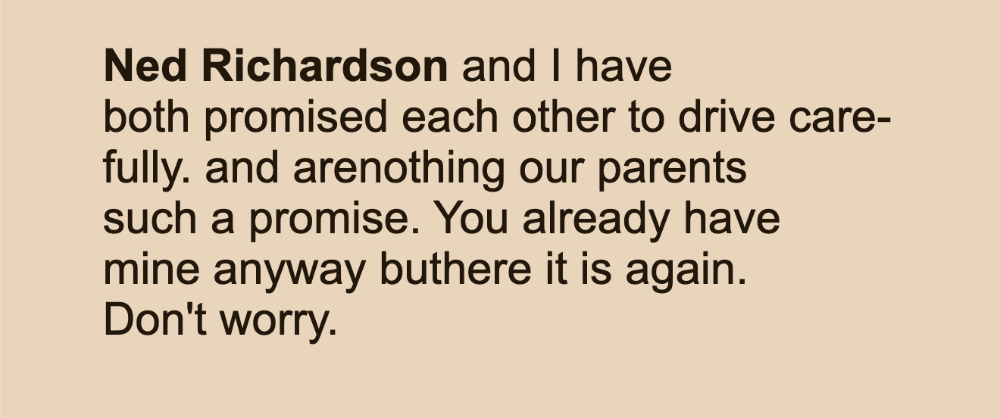
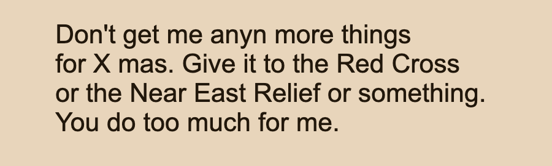
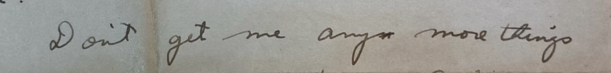
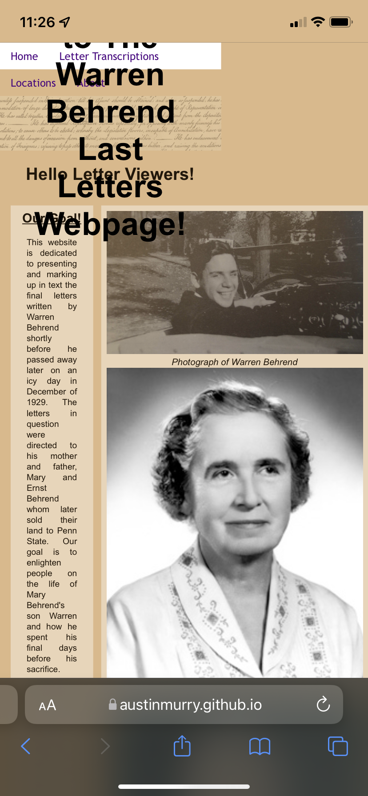
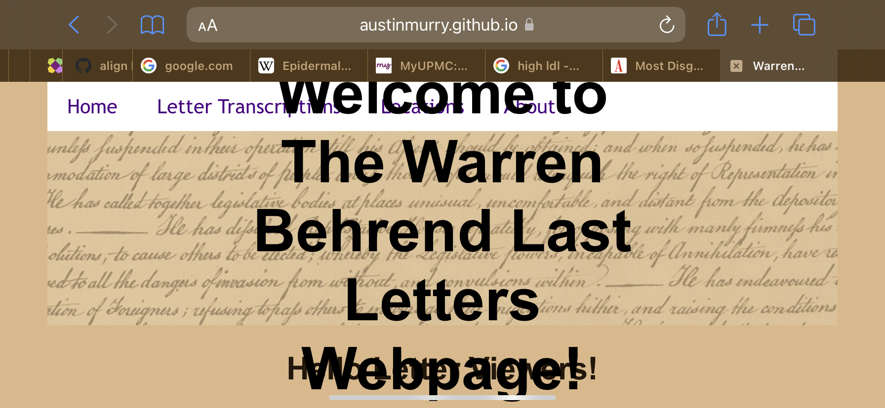

##  Review of Warren Behrend's Last Letters project

* Site publication: <https://austinmurry.github.io/Warren-Letters-Team-1/index.html>
* GitHub: <https://github.com/austinmurry/Warren-Letters-Team-1>
* Developers: Austin Murry, Grace Dill, Joey Gardiner, Thomas Hammer, Nicky Versagli, Sydney Beal
* Date of Evaluation: 2021-12-19
* Evaluated by: @ebeshero

### General  
This team pulled together from two separate teams to coordinate on a shared schema and design a strong project. You have prepared a website archive that makes a wonderful digital resource for learning more about the Behrend family in 1929, and the events of Warren's untimely demise. 

I'd like you to think of this project as something that potentially outlives a semester class, because you designed a real archive, something real to be shared with a wider audience that can potentially have a web presence for a very long time (as long as we choose to maintain it). In that spirit, I am offering comments on how to continue to improve and develop the project. Some of my comments are about things you could not easily complete in the short time frame of a university semester. And some of them are about things that should really be part of your project website to help feature the excellent work you did throughout the semester. 

### XSLT and Reading View
You did well in choosing the feature the persons and places you marked in your letters, and you did a nice job of featuring all the locations mentioned in the letters on a Google map. That map is something you could build on, with the markers for each location holding some reference to the letter in which it was mentioned. (You could include a sentence or paragraph in that place marker, for example.) You could also draw lines between some of the points if you know they are connected as part of the driving path (as opposed to just mentioned). Or if something is on a projected route that they didn't actually reach, you could use a dotted line to distinguish it. 

I like how you made decisions with your XSLT and CSS to feature people and places in the letters very clearly. But there are some other key features of your transcription markup that seem to have gotten lost in transformation. That's a typical problem in XML projects: We can lose sight of things we coded in the XML, and the HTML is often a much simpler rendering. One thing we lost track of in the XSLT is the matter of how to render in HTML the concept of something you all marked as `<unclear>`. For example in Letter 1 (Dec. 17, 1929), you encoded a paragraph in your XML like this:

```xml
<p n="2">
            <ln n="1"/><person personId="NR">Ned Richardson</person> and I have
            <ln n="2"/>both promised each other to drive care-
            <ln n="3"/>fully. and are<unclear reason="not sure what this says">nothing</unclear> our parents
            <ln n="4"/>such a promise. You already have
            <ln n="5"/> mine anyway <unclear reason="1st letter looks like a n, we think it is a the word but.">but</unclear>here it is again. 
            <ln n="6"/><underline>Don't worry</underline>.
        </p>
```

We can clearly see in the XML that you marked two passages as unclear, but in the HTML, we can't see that. Instead we see: 



We can see you marked two words as unclear in the XML, but there is no indication of that in the HTML. Does it matter? Well, in part, the word "nothing" is  getting run into the previous word because the XSLT is simply outputting all the text. If you had an XSLT template for processing `<unclear>` elements you could wrap those in a `<span class="unclear">` to distinguish them visually somehow, maybe giving them a color or a CSS property like a squiggly underline to mark that these are unclear. You could even output in a tooltip (on mouseover make visible) the value of your `@reason` attribute to indicate what you found unclear. You probably do want to go back into the XML and make some spot revisions to control spaces around these elements, to help prevent the words from running together in the HTML output. (Spacing control is a very common problem for digital archive projects to have to manage.) 

Here's another problem spot that *also* turns out to look more problematic than it really is, if only we knew to look at your XML.

As we read your transcript in the HTML, we see this passage:




Of course to an outsider, the sight of "anyn" looks like someone entered a typo and never corrected it. (You and I know that is not really the case, but to an outsider to your project looking in just reading what you have, they won't have a clue about your transcription work.) 


Looking back at the letter image on the left, we find this, showing a deletion of the letter "n" after the word "any": 



So I wondered if you had marked that deletion, and peeked at your XML. Of course you had marked it! You are certainly good, precise transcribers and editors that I always knew you to be! 

```xml
 <p n="9">
            <ln n="1"/>Don't get me any<crossOut>n</crossOut> more things
            <ln n="2"/>for X mas. Give it to the Red Cross
            <ln n="3"/>or the Near East Relief or something.
            <ln n="4"/>You do too much for <crossOut>me</crossOut>.
        </p>

```

In the HTML, because you haven't output anything to style the `<crossOut>` elements, we can't see them as deletions, so this passage reads as if you had transcribed a typo. This kind of problem makes it super important to share your XML openly with your readers, even if you think they won't look at it. People like Jane Ingold and other librarians and researchers who care about Behrend history will certainly look at your XML, and if you don't share it, they won't know what *else* your HTML output might be missing. That leads us to our next point.


### Code View
We are missing a link to your GitHub repo (where we can see the code) from your website! We are more importantly missing a discussion of the team's coding decisions anywhere on the project website. I know from talking to your team this semester that you made some very significant decisions in your schema design for the project, for example, and about what kinds of information you wanted to be marking and sharing. How did you decide to make the map, drawing on information you coded? You could also comment more on information you marked in the XML that maybe we can't see so clearly in the HTML webpage. 

Pointing us directly to the XML files is always important in a project like this. Of course I know where to find them, but your XML markup really is foundation of this project and it's human readable and worth sharing, even if it's not as "pretty" as the website. Digital Humanities projects make a point of sharing all the code "under the hood" as a way of showing your work, and that's important for paying the project forward, too. Scholars and fans and even future students looking at this project would benefit from a view of your XML and your schema, so we really should be including it. So, what I'm recommending is something more than just a single link to the GitHub repo, but rather another page on the site that discusses your coding work, how you designed this project. 


### HTML and CSS 

#### Responsive Design
Your site *mostly* does well in adapting itself for viewing on a wide range of screen sizes. However,
there are two areas where this could be improved:

1. On the main page, notice what happens to the main heading, "Welcome to The Warren Behrend Last Letters Webpage!", when we narrow the page. I took some screen captures on my phone to illustrate:




   
In both of these views, we can see how the `<h1>` element holding the main heading is expanding outside its container, but we can also see that the rest of the page elements are resizing well! So this is one specific problem we can correct. I would recommend *not* relying on absolute positioning to control that main `<h1>`, but rather try re-doing the CSS perhaps as a flexbox or grid in context with its container element. Flexbox or grid would definitely help to make the top section of your page scale responsively.

2. Images throughout the site maintain their proportions when we narrow the screen. it's not bad to view on mobile, but the images could be made to shrink on resizing with a small adjustment to the CSS. How to do this depends on whether you're working in CSS grid or not:

    * If you are *not* using CSS grid around an image, here's a simple solution:
     
       ```css
       figure img {
           max-width: 500px;
           width: 100%;
          }
       ```

        * This basically says, select the `` when it's a child of `<figure>`. Make it's maximum width be `500px` (you can certainly change that, of course, but the idea is that it's a literal pixel value). And make its standard width be `100%`, to fill 100% of the width of its parent container. (If you made the `<figure>` take up 1/3 of the screen, then this would mean the `` inside can only be that width, too. For some reason, that percentage value for `width` needs a little help from the `max-width` property to do its work and help images "know" how large to be in any cntext. 

    * What if you're in a CSS grid context, as on your Letters Transcription page? What you already have in your CSS is *mostly* doing the job: That is, this code *should* be okay, as long as `div.docImage` and `figure` are coded as a CSS grid: 

        
     ```css
     div.docImage > figure > img {
     object-fit:contain;
     width:200%; 
     /* margin-left: 50px;
      margin-top: 20px;   ebb: I would maybe remove 
      these properties in case they interfere with scaling, 
      and use a grid-row-gap or a grid-column-gap property instead.*/  
      }
      ```    

            
    * This code *should* work, but I think it is not because you need some code to define the parent `<figure>` element as a CSS grid. You may also want to set up the `div.docImage` as a CSS grid as well. I don't find these set up as grids in your CSS code, so I am pretty sure that's why the images aren't scaling. Look at how we did this, to create nested grids, in our [example CSS for the Mary Behrend Calendar project](  https://github.com/newtfire/textEncoding-Hub/blob/e6e6106a8c01faafc71eedae0ca5e178b3dcfbb9/Class-Examples/CSS-Grid/Mary-Behrend-Calendar-ReadingView/styling.css#L267)
     The part the handles the responsive scaling is just two CSS rules, from lines 267 - 286. From that code, it appears that we defined a container around the figure to be a grid, and then set the `object-fit` property on the `img` itself (as you did). We can try changing the margin properties to use either `grid-row-gap` or `grid-column-gap` to control the space around the image (depending whether your grid is defined in rows or columns).
       

### Errata: (Small repairs to make in the XML)
Transcription and archive projects need a lot of care, and seem to have a life of their own.
As you look at the site, you'll likely find lots of things to fix, or things you'd transcribe differently. 
When you make corrections, how should you do it? **Make it a policy to always correct the XML**, and re-run the XSLT. The XML is designed to outlast the web display of the data, and you or some other student coder might decide one day to totally overhaul the way you display it. Here is an incomplete list of small corrections you could make:

* Letter from Warren to parents, 1929-12-19: You have "Please dust me a line", and that should read:
   `Please drop me a line`  (That's a colloquial expression from the days of letter writing that maybe we still use in today's text-messaging! It just means, write to me really quickly when you get a chance.) 
   
   
* Letter from parents to Warren, 1929-12-17: I love that you worked out that last sentence with its combination of German and English: "Look forward to our Wiedersehen." Brilliant! There's an error right after that showing M. Warren as signing the letter, but that line isn't in the picture, so you want to remove it. 

* A few lines earlier, you show the letter from mom concluding with "M Warren", but the word is probably "Mother"? (M. Warren doesn't make sense here.) 


### Closing Comments
You have done an amazing job with this project and you were one of the most dedicated and well-coordinated teams I've had the pleasure to work with. Because your work was solid from the beginning and the markup and schema were so strong, that's why I'm making a point of wanting you to feature them on this project, knowing that it will have a long life in helping to educate future students and scholars and readers about Behrend history. 

